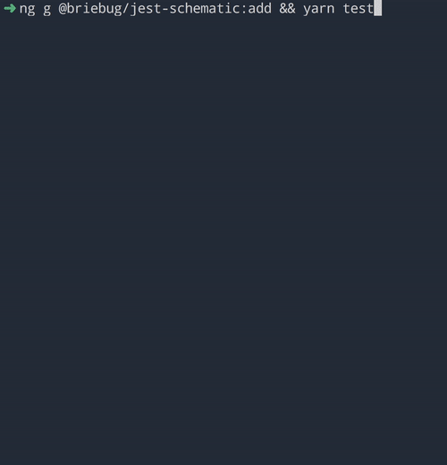
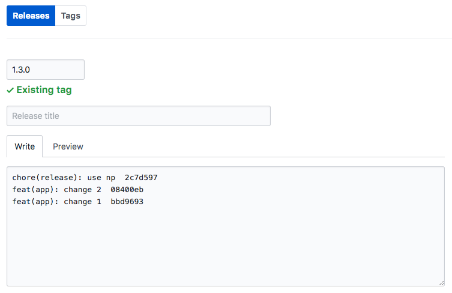

# Jest Angular Schematic

[](https://www.npmjs.com/package/@briebug/jest-schematic)

Add [Jest](https://facebook.github.io/jest/) to an Angular CLI project

This schematic will:

- install Jest, it's dependencies, and new scripts
- add necessary files for Jest to work with Angular
- remove unnecessary Karma files and configuration

## Usage 🚀

Install globally

```shell
npm install -g @briebug/jest-schematic
```

Then in an Angular CLI project run

```shell
ng g @briebug/jest-schematic:add
```



Optionally run as one command in an Angular CLI app directory. Note this will add the schematic as a dependency to your project.

```shell
ng add @briebug/jest-schematic
```

## Issues

If you're experiencing issues when trying to run your tests with Jest, please view the troubleshooting section for [jest-preset-angular](https://github.com/thymikee/jest-preset-angular#troubleshooting) which this schematic utilizes.

A common issues revolves around library dependencies. For example if your app depends on `NgRx` you'll need to tell Jest to compile the sources [explicitly](https://github.com/thymikee/jest-preset-angular#adjust-your-transformignorepatterns-whitelist) by appending it to the `transformIgnorePatterns` property in the `jest.config.js` file.

```js
module.exports = {
  transformIgnorePatterns: ['node_modules/(?!(jest-test|@ngrx))'],
};
```

Issues with this schematic can be filed [here](https://github.com/briebug/jest-schematic/issues/new/choose).

## Development 🛠

### Getting started

```shell
yarn && yarn link:sandbox
```

### Test schematic changes against this repositories Angular CLI sandbox

When running locally, schematic changes will be applied to the test app in the `./sandbox` directory. The sandbox is a bare CLI app allows for testing schematics changes.

Run the following when a schematic change is made:

```shell
yarn build:clean:launch
```

`build:clean:launch` will compile the Typescript, reset the sandbox to is current version controlled state removing un-tracked files, and run the schematic against the sandbox. This will be your main development command.

⚠ **Be careful not to check in changes to the sandbox directory unless necessary.** ⚠

### Test schematics against a local project

- run `yarn build` to compile the schematic in watch mode
- open another shell, cd into the local repo you want to run the schematic against, and run `yarn link @briebug/jest-schematic`. This assumes you've run `yarn link` in this repo on your machine.
  - this will symlink the projects so that the Jest schematic command runs from you're local filesystem
- in the local repo you want to run the schematic against, run `ng g @briebug/jest-schematic:add`

### Dev tips

For faster developing, find and comment out the following line to avoid npm installing dependencies

```ts
context.addTask(new NodePackageInstallTask());
```

### Reset sandbox to its version controlled state

This will reset the sandbox folder to its `HEAD` commit and remove un-tracked files.

```shell
yarn clean
```

### Compile the schematics

Compile the typescript files in watch mode

```shell
yarn build:watch
```

Compile the typescript files once

```shell
yarn build
```

## Testing

### Test local sandbox for regressions

Run a series of standard tests to ensure the `./sandbox` continues to function normally

```shell
yarn test
```

## Getting Started With Schematics

This repository is a basic Schematic implementation that serves as a starting point to create and publish Schematics to NPM.

### Schematic Testing

To test locally, install `@angular-devkit/schematics` globally and use the `schematics` command line tool. That tool acts the same as the `generate` command of the Angular CLI, but also has a debug mode.

Check the documentation with

```bash
schematics --help
```

### Unit Testing

`yarn test:unit` will run the unit tests, using Jasmine as a runner and test framework.

### Publishing

Publishing is handled by [np](https://github.com/sindresorhus/np#usage). Ensure you have push access to this repo and are a [@briebug](https://www.npmjs.com/settings/briebug/packages) NPM contributor. Several [options](https://github.com/sindresorhus/np#usage) are available for releases such as `npm run release --no-publish`.

Once all features are merged into `master`:

1. on your machine, checkout `master`
2. pull latest
3. `npm run release`
4. select the next appropriate version given the changes being added
5. copy the `Commits:` displayed in your shell
6. 
7. edit the new release tag, and paste in the change notes and supply a title if appropriate
8. 

## Documentation

- [Schematics README](https://github.com/angular/angular-cli/blob/master/packages/angular_devkit/schematics/README.md)
- [Angular CLI schematic examples](https://github.com/angular/angular-cli/blob/master/packages/schematics/angular/app-shell/index.ts)